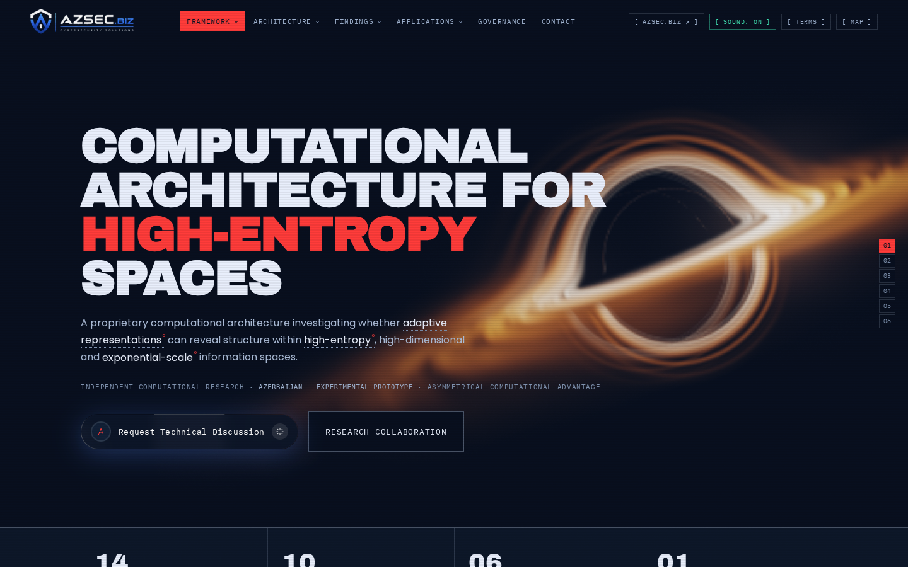
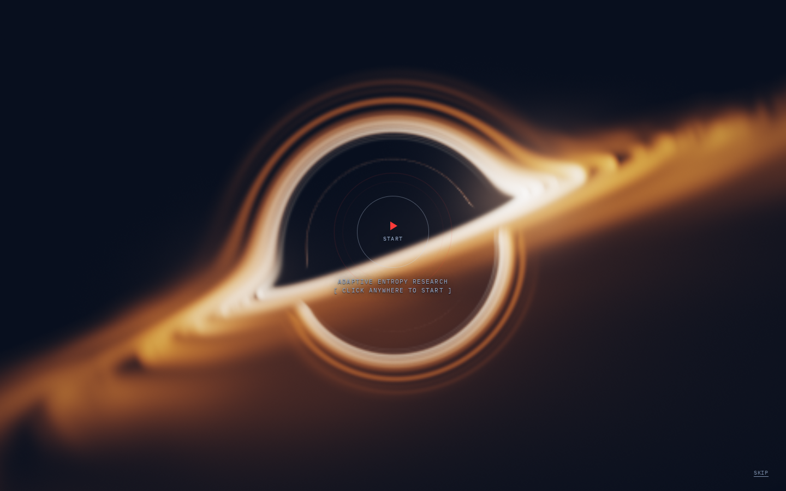
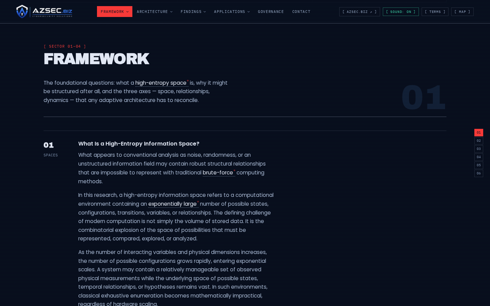

# Adaptive Entropy Research — site

The marketing and research site for **azsec.biz**: a single self-contained HTML
page with a live WebGL black hole, the full 14-sector research text, and a
glossary that annotates its own body copy.

```
git clone <this repo>
cd azsec-site
open index.html          # macOS — or just drag the file into a browser
```

No build step, no server, no dependencies. `index.html` is the deliverable.



| Entry gate | Research content |
|---|---|
|  |  |

---

## Why one file

Everything the page needs at runtime lives inside `index.html`: the stylesheet,
the renderer, the glossary data, and both logos as WebP data URIs. Nothing is
fetched at load except the three Google Fonts.

That is a deliberate constraint, not an accident of how it was written. It
means the page can be dropped onto any static host, pasted into a CMS block,
emailed as an attachment, or opened from a USB stick, and it looks and behaves
identically in all four cases. The cost is a 400 KB file and a long diff when
the copy changes. For a site maintained by one person, that has been the right
trade.

If that stops being true, the natural split is `src/styles.css` +
`src/app.js` + a template, with a build step that inlines them back into
`index.html`. Don't do it halfway: a repo where the built file and the sources
can disagree is worse than either.

---

## Layout

```
index.html                       the site
assets/                          icons and the social card, as real files
  favicon-32.png                   (the favicon is also inlined in index.html)
  apple-touch-icon.png
  icon-512.png
  og-image.png                   1200×630, for og:image
brand/                           source logos, higher resolution than shipped
  logo-full.png                    original lockup, as supplied
  logo-full-keyed.png              background removed — this is what's embedded
  logo-shield.png                  shield mark alone
docs/
  screenshots/                     README images (1440×900, headless Chromium)
  content-audit.html               line-by-line diff against azsec.biz
  type-specimen.html               body-typeface comparison
tools/
  build-artifact.py                strip the page skeleton for embedded hosts
  compare-content.py               regenerate the content audit
  azsec-biz-source-text.txt        azsec.biz copy, read from the live DOM
```

---

## What the page does

**Hero.** A Schwarzschild geodesic raymarcher — gravitational lensing, an
accretion disc, relativistic Doppler beaming — running in WebGL. Not video, not
a texture map. It doubles as an entry gate: the hole is interactive before you
click in, and the camera tweens to its resting frame on entry while the copy
staggers up underneath it. Afterwards the same canvas keeps rendering as the
page background, and pauses itself whenever it scrolls out of view.

**Content.** All 14 sectors from azsec.biz, grouped into 5 chapters, using the
same anchor names — so `#information-space`, `#entropy-foundations` and the
rest resolve the same on both sites.

**Glossary.** 16 defined terms, auto-marked in the body copy by a TreeWalker
pass (max 2 marks per term, 28 in total). Hover for the short definition, click
for the full entry, `[ TERMS ]` in the nav opens the index. Entries are tagged
either *framework term* (this project's own coinage) or *standard term*
(established vocabulary).

**Parallax.** Transform-only, scroll-synced, no scroll library — a fixed depth
field, per-sector watermark words, chapter numerals and diagrams, each moving a
different distance. Travel is zero when an element is centred in the viewport,
so nothing the page lays out ever shifts.

Plus a 3D sector map (`[ MAP ]`), a mega-menu, a chapter rail with scroll-spy,
and an ambient audio toggle.

---

## Editing

| What | Where |
|---|---|
| Colour palette | the `:root` block at the top of `<style>` — every token clears WCAG AA on both surfaces |
| Body typeface | `--prose` in `:root`, one line, changes the whole reading layer |
| Research copy | the `<section id="part-*">` blocks; keep it in step with azsec.biz (see below) |
| Glossary | the `T` object in the second `<script>` — term, kind, short, long |
| Renderer | `createBlackHole()` in the first `<script>`; camera presets are `GATE` and `HOME` |

The stylesheet is commented where a rule is doing something non-obvious. If you
change one of those, change the comment too — a wrong explanation is worse than
none.

---

## Keeping the copy in step with azsec.biz

The research text on this site is azsec.biz's own wording, not a paraphrase.
`tools/compare-content.py` is what proves it: it normalises both sides (case,
punctuation, dashes, ampersands) and matches every block exactly, then by
containment, then by similarity down to 0.72.

```bash
# 1. refresh tools/azsec-biz-source-text.txt from the live site
# 2. dump this page's rendered text to ours.txt
# 3. then:
cd tools && python3 compare-content.py
```

Read the source text out of the live DOM, not through a summarising fetcher —
one tried during this build returned text that read like an embellishment of
the original and would have made the audit worthless.

The last run: **223 source blocks, 223 present, 0 missing.** `docs/content-audit.html`
is that run, rendered. The 19 blocks that exist only here are listed in it with
a reason — all of them caption or introduce the black hole, the equation
animations, the diagrams, or the chapter grouping, none of which azsec.biz has.

---

## Deploying

Any static host. Upload `index.html`; upload `assets/` too if you want the
icons at the web root.

- **Netlify / Vercel / Cloudflare Pages** — drag the folder in; no build command.
- **GitHub Pages** — push, then Settings → Pages → deploy from branch root.
- **Any web server** — copy `index.html` into the document root.

The site is live on GitHub Pages at
<https://rasimovstern.github.io/AzSec-Website-Redesign/>. `og:image` and
`og:url` in `<head>` point there, because link previews need an **absolute**
URL. If the site moves to its own domain, update both.

For a host that supplies its own page skeleton — a Claude Artifact, a CMS HTML
block — run `python3 tools/build-artifact.py`, which writes
`dist/artifact.html` with the `<!doctype>`/`<head>`/`<body>` wrapper removed.
`dist/` is gitignored; it's generated, never edited.

---

## Browser support

Modern evergreen browsers. The hero needs WebGL; without it the page still
reads fine, it just loses the hole. `prefers-reduced-motion` is respected
throughout — the compositions stay, all travel stops, and the hero renders as a
single still exposure.

---

## Known open items

Carried over from the design critique, none of them blocking:

- Heading levels skip in places (`h2` → `h4`/`h5`).
- The entry gate is not a true modal: no `aria-modal`, no focus trap, so a
  keyboard user can tab to content behind it.
- A few nav control chips are under the 44 px touch-target minimum on mobile.
- Glossary terms carry two markers at once — a `°` and a dotted underline.
- Ambient audio starts on entry rather than waiting to be asked for.

---

## Rights

© Adaptive Entropy Research. All rights reserved.

No open-source licence is included on purpose. The research text and the AZSEC
brand assets belong to Adaptive Entropy Research; a permissive licence file
would say otherwise. Add one deliberately if you ever mean to.

Contact: office@azsec.biz
